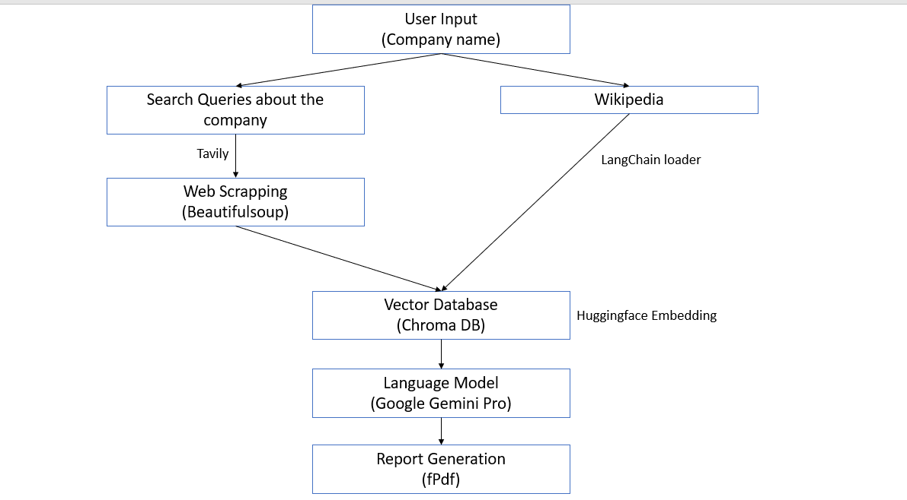
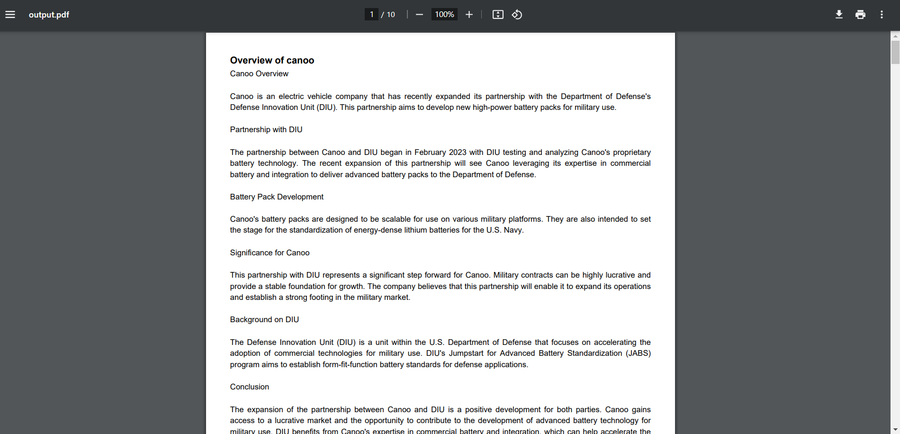

# Market Researcher

Market Researcher is a comprehensive market research tool that leverages the power of AI to automatically generate insightful reports in PDF format.

## Deployment Link

- https://huggingface.co/spaces/rahulathreya45/Market_Research_tool

## Tech Stack

- **Langchain** : Framework
- **Google Gemini** : language model
- **Chroma** : Vector DB
- **Tavlily** : Search Engine
- **Beautifulsoup** : Web scraping
- **FPDF** : Report generation
- **Streamlit** : Frontend
- **Huggingface** : Embedding and Deployment

## Features

- **Automated Research:** Enter the company name and Market Researcher scours the web using advanced search technology to gather relevant information.
- **Fast and Efficient:** Parallel web scraping ensures rapid results, while a well-structured PDF report streamlines your research process.
- **Transparent Sources:** Access and review the original sources used in your report for complete confidence in the data.

## Run Locally

Clone the project

Go to the project directory

Install dependencies

```bash
  pip install requirements.txt
```

To run this project, you will need to add the following environment variables to your .env file

`GOOGLE_API_KEY`

`TAVILY_API_KEY`

- GOOGLE_API_KEY can be obtained from makersuite.com
- TAVILY_API_KEY can be found in tavily.com

## Roadmap

- Faster Response

- More queries

- Improvements in Report formatting

## Architecture



## Screenshots




