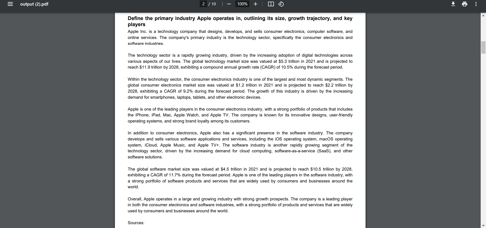

# Market Researcher

Market Researcher is a tool which searches the internet and generates comprehensive report in PDF format.


## Tech Stack

* **Langchain** : Framework
* **Google Gemini** : language model
* **Chroma** : Vector DB
* **Tavlily** : Search Engine
* **Beautifulsoup** : Web scraping
* **FPDF** : report generation 

## Features

- Added wikipedia loader 
- Paralle web scraping for faster results
- output as a PDF file in well stuctured manner


## Run Locally

Clone the project

Go to the project directory

Install dependencies

```bash
  pip install requirements.txt
```


To run this project, you will need to add the following environment variables to your .env file

`GOOGLE_API_KEY`

`TAVILY_API_KEY`

* GOOGLE_API_KEY can be obtained from makersuite.com
* TAVILY_API_KEY can be found in tavily.com 
## Roadmap

- Front End

- More queries 

* More Companies


## Screenshots





